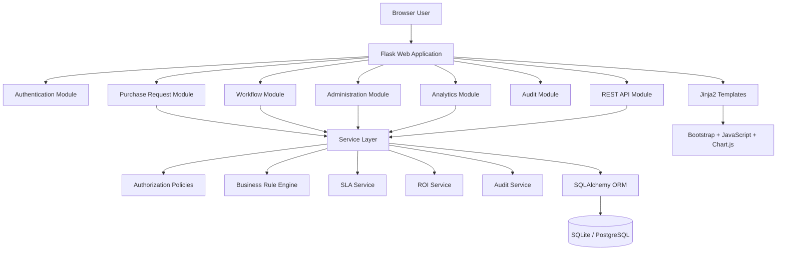

# FlowYield Application Architecture

## 1. Purpose

This document defines the technical architecture of the FlowYield MVP.

The architecture must support:

- a complete purchase request workflow;
- secure authentication and authorization;
- rule-based approval routing;
- workflow state transitions;
- SLA tracking;
- structured audit logging;
- dashboard analytics;
- ROI calculations;
- automated testing;
- clear documentation;
- future deployment to a production environment.

The architecture is intentionally designed for a single-developer portfolio project.

It must demonstrate professional software engineering without introducing unnecessary distributed-system complexity.

---

## 2. Architectural Goals

The FlowYield architecture should be:

- modular;
- testable;
- maintainable;
- understandable;
- secure;
- suitable for incremental development;
- suitable for technical interviews;
- realistic for a business application;
- simple enough to complete.

The architecture should make important business rules visible in dedicated components rather than hiding them inside routes, templates, or database callbacks.

---

## 3. Architectural Constraints

The MVP will use:

- Python;
- Flask;
- Flask application factory;
- Flask Blueprints;
- SQLAlchemy;
- Flask-Migrate;
- SQLite for local development;
- PostgreSQL for production deployment if required;
- Jinja2;
- Bootstrap;
- JavaScript;
- Chart.js;
- pytest;
- Git;
- GitHub Actions;
- environment variables;
- structured application logging.

The MVP will not use:

- React;
- microservices;
- Kubernetes;
- Redis;
- Celery;
- RabbitMQ;
- Kafka;
- GraphQL;
- NoSQL databases;
- event sourcing;
- serverless functions;
- machine learning;
- large language models.

These technologies do not solve a necessary MVP problem and would add disproportionate complexity.

---

## 4. Architecture Style

FlowYield will use a modular monolith architecture.

A modular monolith means:

- the application is deployed as one Flask application;
- the code is separated into clear business modules;
- each module has defined responsibilities;
- business logic is not mixed indiscriminately across routes;
- the database is shared;
- deployment remains simple;
- internal boundaries are still respected.

This architecture is appropriate because:

- the project is developed by one person;
- the workflow is complex enough to require modularity;
- distributed deployment is unnecessary;
- transactions across workflow, audit, and SLA data are easier to manage in one application;
- local development and testing remain straightforward.

---

## 5. High-Level Architecture



---

## 6. Request Flow

A typical browser request should follow this path:

```text
Browser
-> Flask route
-> authentication check
-> route-level permission check
-> input validation
-> service-layer operation
-> object-level authorization
-> business rule evaluation
-> database transaction
-> audit creation
-> response rendering
```

A route must not directly perform the complete business operation.

Routes should remain thin.

They should primarily:

- receive HTTP input;
- validate the request form or JSON payload;
- call the appropriate service;
- translate domain errors into user-facing responses;
- render templates or return JSON.

---

## 7. Proposed Project Structure

```text
FlowYield/
├── app/
│   ├── __init__.py
│   ├── extensions.py
│   ├── config.py
│   │
│   ├── auth/
│   │   ├── __init__.py
│   │   ├── routes.py
│   │   ├── forms.py
│   │   ├── services.py
│   │   └── templates/
│   │       └── auth/
│   │
│   ├── admin/
│   │   ├── __init__.py
│   │   ├── routes.py
│   │   ├── forms.py
│   │   ├── services.py
│   │   └── templates/
│   │       └── admin/
│   │
│   ├── requests/
│   │   ├── __init__.py
│   │   ├── routes.py
│   │   ├── forms.py
│   │   ├── services.py
│   │   ├── policies.py
│   │   └── templates/
│   │       └── requests/
│   │
│   ├── workflows/
│   │   ├── __init__.py
│   │   ├── routes.py
│   │   ├── services.py
│   │   ├── rules.py
│   │   ├── transitions.py
│   │   ├── assignments.py
│   │   ├── exceptions.py
│   │   └── templates/
│   │       └── workflows/
│   │
│   ├── analytics/
│   │   ├── __init__.py
│   │   ├── routes.py
│   │   ├── services.py
│   │   └── templates/
│   │       └── analytics/
│   │
│   ├── audit/
│   │   ├── __init__.py
│   │   ├── routes.py
│   │   ├── services.py
│   │   └── templates/
│   │       └── audit/
│   │
│   ├── api/
│   │   ├── __init__.py
│   │   ├── routes.py
│   │   ├── serializers.py
│   │   └── errors.py
│   │
│   ├── models/
│   │   ├── __init__.py
│   │   ├── user.py
│   │   ├── organization.py
│   │   ├── purchase_request.py
│   │   ├── workflow.py
│   │   ├── audit.py
│   │   └── analytics.py
│   │
│   ├── common/
│   │   ├── decorators.py
│   │   ├── permissions.py
│   │   ├── pagination.py
│   │   ├── validators.py
│   │   ├── logging.py
│   │   └── exceptions.py
│   │
│   ├── templates/
│   │   ├── base.html
│   │   ├── components/
│   │   └── errors/
│   │
│   └── static/
│       ├── css/
│       ├── js/
│       └── img/
│
├── migrations/
│
├── tests/
│   ├── conftest.py
│   ├── unit/
│   ├── integration/
│   ├── routes/
│   ├── api/
│   └── security/
│
├── docs/
│   ├── product/
│   ├── architecture/
│   ├── decisions/
│   ├── security/
│   └── operations/
│
├── instance/
├── scripts/
├── .env.example
├── .editorconfig
├── .gitignore
├── pyproject.toml
├── requirements.txt
├── requirements-dev.txt
├── run.py
└── README.md
```

This structure may be adjusted during implementation, but naming should remain consistent once adopted.

---

## 8. Application Factory

FlowYield will use the Flask application factory pattern.

The factory will:

- create the Flask application;
- load the selected configuration;
- initialize extensions;
- register Blueprints;
- register error handlers;
- register CLI commands;
- configure logging;
- configure authentication callbacks;
- configure template helpers.

Conceptually:

```text
create_app(config_name)
```

The application factory improves:

- testing;
- configuration separation;
- extension initialization;
- deployment flexibility;
- avoidance of global application state.

It also allows tests to create isolated application instances with a dedicated test database.

---

## 9. Extension Initialization

Flask extensions should be created without binding them immediately to one application instance.

They should be initialized in a central module such as:

```text
app/extensions.py
```

Expected extensions include:

- SQLAlchemy;
- Flask-Migrate;
- Flask-Login;
- Flask-WTF CSRF protection.

Conceptual pattern:

```text
db = SQLAlchemy()
migrate = Migrate()
login_manager = LoginManager()
csrf = CSRFProtect()
```

The application factory will later call each extension's initialization method.

This avoids circular imports and supports testing.

---

## 10. Blueprint Boundaries

Each Blueprint represents a meaningful application capability.

### Auth Blueprint

Responsibilities:

- login;
- logout;
- authentication-related session handling.

It must not contain:

- workflow decisions;
- user administration;
- analytics calculations.

### Admin Blueprint

Responsibilities:

- user creation;
- user activation and deactivation;
- role assignment;
- department assignment;
- manager assignment.

### Requests Blueprint

Responsibilities:

- purchase request creation;
- draft editing;
- request submission;
- request detail pages;
- own-request lists;
- return-for-changes editing;
- resubmission.

### Workflows Blueprint

Responsibilities:

- approver task queue;
- approve action;
- reject action;
- return-for-changes action;
- workflow configuration pages.

### Analytics Blueprint

Responsibilities:

- KPI dashboard;
- SLA analytics;
- bottleneck analytics;
- ROI views.

### Audit Blueprint

Responsibilities:

- audit log list;
- audit filters;
- audit detail presentation.

### API Blueprint

Responsibilities:

- selected authenticated JSON endpoints;
- JSON error handling;
- serialization.

---

## 11. Service Layer

The service layer contains application use cases and business orchestration.

Examples:

```text
AuthenticationService
UserAdministrationService
PurchaseRequestService
WorkflowService
ApprovalService
WorkflowConfigurationService
SLAService
AuditService
AnalyticsService
ROIService
```

Services should:

- coordinate multiple models;
- enforce business rules;
- call authorization policies;
- manage workflow transitions;
- create audit records;
- participate in database transactions;
- raise controlled domain exceptions.

Services should not:

- render templates;
- access Flask request globals unnecessarily;
- contain HTML;
- return Flask responses;
- silently swallow business errors.

---

## 12. Business Rule Layer

Approval-path generation must be separated from routes and templates.

The rule layer will decide whether the request requires:

- Manager Approval;
- IT Review;
- Finance Approval;
- Director Approval.

The rule engine for the MVP should remain deterministic and constrained.

It may receive:

```text
Purchase request data
+ Active workflow configuration
```

and return:

```text
Ordered step definitions
+ Rule explanations
```

Example conceptual result:

```text
[
  MANAGER_APPROVAL,
  IT_REVIEW,
  FINANCE_APPROVAL
]
```

with explanations such as:

```text
Manager Approval is required for every request.
IT Review is required because category is SOFTWARE and amount exceeds EUR 5,000.
Finance Approval is required because amount is at least EUR 1,000.
```

The MVP will not implement a generic expression language.

---

## 13. Workflow Transition Layer

Workflow transitions should be centralized.

Expected operations include:

```text
initialize_workflow()
approve_step()
reject_step()
return_for_changes()
resubmit_request()
activate_next_step()
complete_request()
```

Each transition must validate:

- current request status;
- current step status;
- assigned user;
- required role;
- self-approval rule;
- previous-step completion;
- duplicate-action prevention.

The transition layer should raise controlled exceptions for invalid operations.

---

## 14. Authorization Architecture

FlowYield will combine:

```text
Authentication
+ Active account
+ Role
+ Permission
+ Object relationship
+ Workflow assignment
+ Current state
```

Authorization will exist at multiple levels.

### Route-Level Checks

Used for broad capability access.

Examples:

- Administrator-only pages;
- Process Manager-only configuration pages;
- Auditor-only raw audit pages.

### Object-Level Policies

Used for resource-specific decisions.

Examples:

```text
can_view_request(user, request)
can_edit_request(user, request)
can_cancel_request(user, request)
```

### Workflow-Level Policies

Used for approval decisions.

Example:

```text
can_decide_step(user, step)
```

The final decision must be revalidated inside the service layer.

Templates may hide buttons based on permission helpers, but this is not a security boundary.

---

## 15. Data Access Strategy

FlowYield will use SQLAlchemy ORM.

For the MVP, the project will not introduce a generic repository pattern for every model.

Reasons:

- SQLAlchemy already provides a unit-of-work style session;
- a full repository layer would add repetitive wrappers;
- the project should avoid abstraction without a concrete problem;
- services can use well-structured model queries directly.

However, complex analytics queries may be placed in:

- dedicated query functions;
- analytics query modules;
- model query helpers where appropriate.

The key rule is that SQL queries must not be scattered randomly through route functions.

---

## 16. Database Transactions

Business operations that update multiple records must be atomic.

Examples:

- request submission;
- workflow initialization;
- approval;
- rejection;
- return for changes;
- resubmission;
- workflow configuration changes.

An approval transaction may update:

- the active step;
- the approval decision;
- the next step;
- the request status;
- SLA results;
- audit records.

If one part fails, the whole transaction must roll back.

Transaction boundaries should be owned by the service layer.

---

## 17. Domain Exceptions

Business failures should use explicit exceptions.

Examples:

```text
InvalidTransitionError
UnauthorizedWorkflowActionError
DuplicateDecisionError
SelfApprovalError
ApproverAssignmentError
MissingManagerError
InactiveApproverError
RequestValidationError
WorkflowConfigurationError
ResourceConflictError
```

Routes should translate these exceptions into:

- flash messages and redirects for browser flows;
- 400, 403, 404, or 409 responses where appropriate;
- structured JSON errors for API endpoints;
- safe application logs.

Unexpected exceptions should not be presented directly to users.

---

## 18. Configuration Architecture

FlowYield will separate configuration by environment.

Expected configuration classes:

```text
BaseConfig
DevelopmentConfig
TestingConfig
ProductionConfig
```

Configuration will include:

- secret key;
- database URL;
- CSRF settings;
- session cookie settings;
- logging level;
- upload limits if attachments are added;
- testing flags.

Secrets must come from environment variables.

Safe examples belong in:

```text
.env.example
```

Real values belong in:

```text
.env
```

The `.env` file must remain ignored by Git.

---

## 19. Environment Strategy

### Development

Uses:

- local SQLite database;
- debug-friendly logging;
- local `.env`;
- development configuration.

### Testing

Uses:

- isolated temporary database;
- testing configuration;
- deterministic fixtures;
- CSRF configuration appropriate for route tests;
- no dependency on development data.

### Production

Uses:

- production secret key;
- PostgreSQL if deployed;
- secure cookie settings;
- debug disabled;
- production logging;
- environment-based configuration;
- WSGI server.

---

## 20. Authentication Architecture

Flask-Login will manage authenticated sessions.

The application will:

- load users by ID;
- reject inactive users;
- protect authenticated routes;
- redirect browser users to login;
- return appropriate API errors;
- clear sessions during logout.

Password hashing will use Werkzeug's secure password hashing helpers.

Plain-text passwords must never be stored.

Authentication logic should be placed in a dedicated service rather than duplicated across routes.

---

## 21. Form and Input Validation

Browser forms will use Flask-WTF and WTForms.

Validation must occur server-side.

Examples:

- valid email format;
- unique user email;
- positive request amount;
- permitted request category;
- valid expected purchase date;
- required rejection comment;
- required return-for-changes comment;
- consistent workflow thresholds;
- positive SLA durations.

Client-side validation may improve usability but must not replace server-side validation.

API payloads require explicit validation before service execution.

---

## 22. Audit Architecture

Audit events must be structured.

An audit event should contain fields such as:

- actor ID;
- action type;
- entity type;
- entity ID;
- request ID where relevant;
- previous state;
- new state;
- timestamp;
- structured metadata.

Audit creation should occur through a centralized Audit Service.

The application must not store:

- passwords;
- session tokens;
- secret keys;
- unnecessary sensitive data.

Audit records should be read-only through the application.

---

## 23. SLA Architecture

The SLA Service will be responsible for:

- calculating deadlines;
- calculating approaching-deadline status;
- calculating overdue status;
- recording completion performance;
- calculating overdue duration;
- exposing results to analytics.

The SLA clock starts only when a workflow step becomes active.

The MVP uses elapsed clock hours rather than business calendars.

Background workers are not required.

Current SLA status can be calculated when relevant pages or analytics are requested.

---

## 24. Analytics Architecture

Analytics calculations should be implemented in dedicated services.

Examples:

- total request count;
- status counts;
- approval rate;
- rejection rate;
- average duration;
- median duration;
- SLA compliance rate;
- average duration by step;
- slowest step;
- monthly volume;
- volume by category;
- volume by department.

Analytics code must not be embedded in templates.

The same calculations should support:

- server-rendered dashboards;
- selected JSON endpoints;
- automated tests.

---

## 25. ROI Architecture

The ROI Service will separate:

- configurable assumptions;
- measured process values;
- calculated estimates.

Expected inputs include:

- estimated manual processing time;
- estimated digital processing time;
- hourly employee cost;
- number of processed requests;
- manual interventions before automation;
- manual interventions after automation;
- implementation cost.

Expected outputs include:

- hours saved;
- time reduction percentage;
- estimated cost saved;
- saving per request;
- monthly savings;
- annualized savings;
- ROI percentage;
- payback period.

Every formula must be documented and tested.

The UI must clearly label estimates and assumptions.

---

## 26. API Architecture

The application will remain primarily server-rendered.

The API will demonstrate selected REST design without duplicating the entire application.

Initial endpoints may include:

```text
GET /api/v1/requests/<request_id>/status
GET /api/v1/approval-tasks
GET /api/v1/dashboard
```

The API must include:

- authentication;
- object-level authorization;
- structured JSON responses;
- validated query parameters;
- consistent error format;
- appropriate status codes.

A possible error format:

```json
{
  "error": {
    "code": "forbidden",
    "message": "You are not authorized to access this resource."
  }
}
```

The API will not use OAuth or API keys in the MVP.

---

## 27. Template Architecture

The application will use Jinja2 templates.

A shared base template should provide:

- document structure;
- navigation;
- flash messages;
- page title;
- Bootstrap assets;
- common scripts;
- accessibility landmarks.

Reusable components may include:

- status badges;
- SLA badges;
- pagination;
- empty states;
- metric cards;
- workflow timelines;
- confirmation modals.

Business logic must not be implemented inside templates.

Templates may format already-computed values and conditionally display authorized controls.

---

## 28. Frontend Strategy

The frontend will use:

- Bootstrap for layout and components;
- custom CSS for product identity;
- small JavaScript modules for interaction;
- Chart.js for dashboard charts.

The application does not require a single-page frontend.

Server rendering is appropriate because:

- the application is form-heavy;
- the interaction model is straightforward;
- authentication and authorization remain centralized;
- development scope stays manageable;
- SEO is irrelevant for the internal application;
- the portfolio can still demonstrate API design selectively.

---

## 29. Logging Architecture

Application logging should include:

- timestamp;
- severity;
- logger name;
- request context where safe;
- exception details for internal logs;
- business identifiers where useful.

Logging must not include:

- passwords;
- session tokens;
- secret keys;
- complete sensitive payloads.

Different environments may use different log levels.

Expected levels:

- `DEBUG` for development diagnostics;
- `INFO` for normal application events;
- `WARNING` for recoverable or suspicious behavior;
- `ERROR` for failed operations;
- `CRITICAL` for severe failures.

Audit logs and technical logs are separate concepts.

---

## 30. Error Handling Architecture

Custom error handlers should exist for:

- 400 Bad Request;
- 401 Unauthorized for API flows;
- 403 Forbidden;
- 404 Not Found;
- 409 Conflict where appropriate;
- 500 Internal Server Error.

Browser requests should receive professional HTML pages.

API requests should receive structured JSON errors.

Production responses must not expose stack traces or internal file paths.

---

## 31. Testing Architecture

The test suite will use pytest.

Expected test categories:

### Unit Tests

For:

- rule evaluation;
- SLA calculations;
- ROI calculations;
- permission helpers;
- transition validation.

### Integration Tests

For:

- services with the database;
- workflow initialization;
- approval transactions;
- resubmission;
- audit creation.

### Route Tests

For:

- login;
- logout;
- request pages;
- approval actions;
- administrative pages;
- error responses.

### API Tests

For:

- authentication;
- authorization;
- response formats;
- status codes;
- validation.

### Security Tests

For:

- object-level access;
- self-approval prevention;
- duplicate decisions;
- out-of-order actions;
- inactive users.

Tests should use:

- application factory;
- isolated test configuration;
- fresh test database;
- reusable fixtures;
- deterministic seed data.

---

## 32. Continuous Integration

GitHub Actions will eventually:

- install the supported Python version;
- install project dependencies;
- run formatting or lint checks;
- run the full test suite;
- optionally generate coverage information.

CI should run on:

- pushes to `main`;
- pull requests targeting `main`.

CI must not depend on local files or committed secrets.

---

## 33. Deployment Architecture

Deployment is deferred until the local MVP is stable.

The production deployment may use:

- a supported hosting platform;
- Gunicorn or another appropriate WSGI server;
- PostgreSQL;
- environment variables;
- database migrations;
- secure session settings;
- production logging.

Docker is optional.

It should be added only if it improves reproducibility or deployment clarity.

---

## 34. Security Boundaries

The application must protect against:

- unauthorized route access;
- object ID guessing;
- self-approval;
- duplicate decisions;
- out-of-order transitions;
- mass assignment;
- CSRF;
- unsafe output rendering;
- insecure file uploads if attachments are added;
- committed secrets;
- verbose production errors.

Security decisions will be documented separately.

---

## 35. Architecture Decision: No Generic Repository Pattern

FlowYield will not initially use a repository class for every database model.

Reasoning:

- it would wrap SQLAlchemy without adding enough value;
- it could create unnecessary boilerplate;
- service-layer boundaries already separate business logic from routes;
- SQLAlchemy queries can remain readable and testable;
- complex queries can be isolated when they actually appear.

This decision may be reconsidered if persistence logic becomes difficult to maintain.

---

## 36. Architecture Decision: No Generic Rule Language

FlowYield will not initially support arbitrary user-authored rule expressions.

Reasoning:

- the MVP has a small, known rule set;
- a generic language requires parsing, validation, security, and debugging;
- constrained configuration is enough to demonstrate rule-based processing;
- deterministic Python rules are easier to test and explain.

The architecture will still isolate rules so they can evolve later.

---

## 37. Architecture Decision: Server-Rendered UI

FlowYield will use server-rendered pages for the primary interface.

Reasoning:

- the application is workflow- and form-oriented;
- Flask and Jinja2 match the developer's current experience;
- server rendering reduces frontend complexity;
- authorization remains easier to enforce consistently;
- REST endpoints can still demonstrate API competence.

React or another SPA framework would add effort without improving the core portfolio value enough.

---

## 38. Architecture Decision: SQLite First, PostgreSQL Later

SQLite will be used during early development because:

- setup is minimal;
- local development is simple;
- tests are fast;
- no database server is required.

PostgreSQL may be introduced before public deployment because:

- it better represents a production relational database;
- concurrency behavior is stronger;
- deployment platforms commonly support it;
- the migration demonstrates environment-aware database configuration.

Code should avoid SQLite-specific assumptions where practical.

---

## 39. Dependency Rules

To preserve architectural boundaries:

- templates must not access database sessions directly;
- routes must not contain complete workflow algorithms;
- models must not depend on routes;
- services may depend on models and common policies;
- analytics may read workflow and request data;
- API routes should reuse the same services as browser routes;
- audit service may be called by business services;
- frontend JavaScript must not be trusted for authorization;
- configuration must not import application modules that create circular dependencies.

---

## 40. Definition of Done

The architecture is successfully implemented when:

- the application starts through an application factory;
- extensions are initialized centrally;
- major capabilities are separated into Blueprints;
- routes remain thin;
- business operations are implemented in services;
- workflow rules are isolated;
- transition validation is centralized;
- authorization includes object and workflow context;
- multi-record operations are transactional;
- audit creation is centralized;
- SLA and ROI calculations are isolated and testable;
- environment-specific configuration exists;
- tests can create isolated application instances;
- templates do not contain business logic;
- selected API endpoints reuse application services;
- the project remains understandable to another developer.
