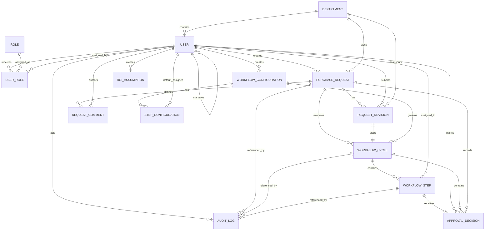
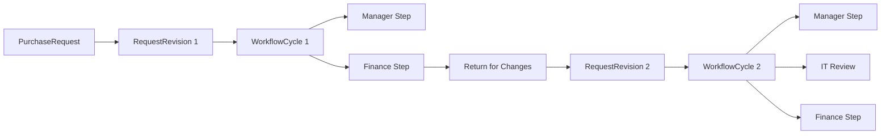

# FlowYield Database Design

## 1. Purpose

This document defines the relational data model for the FlowYield MVP.

The database must support:

- authentication;
- user and role management;
- departments and reporting relationships;
- purchase request drafts;
- request revisions;
- workflow configuration;
- workflow cycles;
- approval steps;
- approval decisions;
- SLA tracking;
- structured audit logging;
- dashboard analytics;
- ROI calculations;
- realistic demonstration data.

The model must remain understandable, normalized, and realistic for a single-developer portfolio project.

---

## 2. Database Strategy

FlowYield will use:

- SQLite during local development;
- SQLAlchemy as the ORM;
- Flask-Migrate for schema migrations;
- PostgreSQL for production deployment if required.

The schema should avoid SQLite-specific behavior where practical.

Important business data must be stored relationally.

Structured JSON may be used only where flexibility is useful and the data does not require frequent relational querying.

---

## 3. Design Principles

The data model follows these principles:

- one source of truth for each business concept;
- explicit foreign-key relationships;
- stable historical records;
- no destructive deletion of auditable business history;
- separation between request data and workflow execution data;
- separation between current request state and historical revisions;
- deterministic workflow reconstruction;
- database constraints for important invariants;
- application-level validation for rules that cannot be expressed cleanly as constraints.

---

## 4. Main Domain Areas

The schema is divided conceptually into:

### Identity and Organization

- `User`;
- `Role`;
- `UserRole`;
- `Department`.

### Purchase Request Domain

- `PurchaseRequest`;
- `RequestRevision`;
- `RequestComment`.

### Workflow Configuration

- `WorkflowConfiguration`;
- `StepConfiguration`.

### Workflow Execution

- `WorkflowCycle`;
- `WorkflowStep`;
- `ApprovalDecision`.

### Audit and Analytics

- `AuditLog`;
- `ROIAssumption`.

Attachments remain optional and may be added later.

---

# 5. Identity and Organization Entities

## 5.1 User

### Responsibility

Represents an application user and employee of Aurevia Solutions.

### Important Fields

- `id`;
- `email`;
- `first_name`;
- `last_name`;
- `password_hash`;
- `is_active`;
- `department_id`;
- `manager_id`;
- `created_at`;
- `updated_at`;
- `last_login_at`.

### Relationships

- belongs to one Department;
- may report to another User;
- may have multiple direct reports;
- may hold multiple Roles;
- may own multiple Purchase Requests;
- may be assigned to Workflow Steps;
- may create Approval Decisions;
- may create Audit Logs.

### Constraints

- email must be unique;
- email must be non-null;
- password hash must be non-null;
- a user cannot be their own manager;
- inactive users remain stored;
- user deletion should not be used for users referenced by business history.

### Notes

The reporting relationship uses a self-referencing foreign key:

```text
user.manager_id -> user.id
```

This supports Manager Approval assignment.

---

## 5.2 Role

### Responsibility

Represents a named application role.

### Initial Role Values

- `ADMINISTRATOR`;
- `REQUESTER`;
- `MANAGER_APPROVER`;
- `FINANCE_APPROVER`;
- `IT_REVIEWER`;
- `DIRECTOR_APPROVER`;
- `PROCESS_MANAGER`;
- `AUDITOR`;
- `EXECUTIVE_VIEWER`.

### Important Fields

- `id`;
- `name`;
- `description`;
- `created_at`.

### Constraints

- role name must be unique;
- role name must be non-null.

### Notes

Roles are seeded and not created dynamically through the MVP interface.

---

## 5.3 UserRole

### Responsibility

Association entity for the many-to-many relationship between User and Role.

### Important Fields

- `user_id`;
- `role_id`;
- `assigned_at`;
- `assigned_by_user_id`.

### Constraints

- `(user_id, role_id)` must be unique;
- assigned user and role must exist.

### Notes

Using an explicit association entity instead of a bare join table allows role-assignment auditing and future metadata.

---

## 5.4 Department

### Responsibility

Represents an organizational department.

### Example Values

- Operations;
- Finance;
- Procurement;
- Information Technology;
- Human Resources;
- Legal;
- Sales;
- Executive Management.

### Important Fields

- `id`;
- `name`;
- `code`;
- `is_active`;
- `created_at`;
- `updated_at`.

### Constraints

- department name must be unique;
- department code must be unique;
- inactive departments remain available for historical references.

---

# 6. Purchase Request Entities

## 6.1 PurchaseRequest

### Responsibility

Represents the current business request and its current lifecycle state.

### Important Fields

- `id`;
- `reference_number`;
- `requester_id`;
- `department_id`;
- `title`;
- `description`;
- `business_justification`;
- `category`;
- `supplier`;
- `requested_amount`;
- `currency`;
- `expected_purchase_date`;
- `status`;
- `current_revision_number`;
- `active_workflow_cycle_id`;
- `created_at`;
- `updated_at`;
- `submitted_at`;
- `completed_at`;
- `cancelled_at`.

### Request Status Values

- `DRAFT`;
- `SUBMITTED`;
- `IN_REVIEW`;
- `CHANGES_REQUESTED`;
- `APPROVED`;
- `REJECTED`;
- `CANCELLED`.

### Relationships

- belongs to one requester;
- belongs to one department;
- has many Request Revisions;
- has many Workflow Cycles;
- has many Request Comments;
- may reference one active Workflow Cycle;
- has many Audit Logs.

### Constraints

- reference number must be unique;
- requested amount must be positive when submitted;
- currency is restricted to EUR in the MVP;
- requester and department are required;
- current revision number must be at least 0;
- final statuses must not accept new workflow actions.

### Notes

The current business fields remain on PurchaseRequest for simple querying and rendering.

Every submission or resubmission also creates an immutable RequestRevision snapshot.

This avoids rebuilding the current request from revision records while still preserving history.

---

## 6.2 RequestRevision

### Responsibility

Stores an immutable snapshot of the request each time it is submitted or resubmitted.

### Important Fields

- `id`;
- `purchase_request_id`;
- `revision_number`;
- `title`;
- `description`;
- `business_justification`;
- `category`;
- `supplier`;
- `requested_amount`;
- `currency`;
- `expected_purchase_date`;
- `department_id`;
- `submitted_by_user_id`;
- `submitted_at`;
- `workflow_configuration_id`;
- `change_summary`.

### Relationships

- belongs to one Purchase Request;
- belongs to one Department snapshot reference;
- belongs to one submitting User;
- references the Workflow Configuration used;
- has one Workflow Cycle for that revision.

### Constraints

- `(purchase_request_id, revision_number)` must be unique;
- revision number must be greater than 0;
- submitted fields are immutable through the application.

### Notes

A revision is created only on submission or resubmission.

Draft saves do not create full revisions.

This keeps the model useful without producing excessive history records.

---

## 6.3 RequestComment

### Responsibility

Stores human comments associated with a purchase request.

### Important Fields

- `id`;
- `purchase_request_id`;
- `workflow_cycle_id`;
- `author_id`;
- `comment_type`;
- `body`;
- `created_at`.

### Comment Type Values

Possible values:

- `GENERAL`;
- `REQUESTER_RESPONSE`;
- `APPROVER_NOTE`;
- `SYSTEM_NOTE`.

### Relationships

- belongs to one Purchase Request;
- optionally belongs to one Workflow Cycle;
- belongs to one author.

### Constraints

- body must not be empty;
- system notes may use a dedicated system actor or nullable author policy;
- comments are not editable after creation in the MVP.

### Notes

Decision reasons remain stored in ApprovalDecision.

RequestComment is for conversational or supporting context, not the authoritative approval result.

---

# 7. Workflow Configuration Entities

## 7.1 WorkflowConfiguration

### Responsibility

Represents a versioned set of workflow rules used for new request submissions.

### Important Fields

- `id`;
- `version_number`;
- `name`;
- `low_value_threshold`;
- `high_value_threshold`;
- `it_review_threshold`;
- `it_review_enabled`;
- `is_active`;
- `effective_from`;
- `created_by_user_id`;
- `created_at`;
- `activated_at`;
- `archived_at`.

### Relationships

- created by one User;
- has many Step Configurations;
- may be referenced by many Request Revisions;
- may be referenced by many Workflow Cycles.

### Constraints

- version number must be unique;
- thresholds must be positive;
- low-value threshold must be below high-value threshold;
- only one configuration may be active at a time;
- historical configurations must not be overwritten.

### Notes

A Process Manager change creates a new configuration version rather than modifying the active historical record in place.

This ensures in-progress and historical workflows remain explainable.

---

## 7.2 StepConfiguration

### Responsibility

Stores SLA and default assignment configuration per workflow step type.

### Important Fields

- `id`;
- `workflow_configuration_id`;
- `step_type`;
- `sla_duration_hours`;
- `default_assignee_user_id`;
- `required_role_name`;
- `sequence_hint`;
- `is_enabled`;
- `created_at`.

### Step Type Values

- `MANAGER_APPROVAL`;
- `IT_REVIEW`;
- `FINANCE_APPROVAL`;
- `DIRECTOR_APPROVAL`.

### Relationships

- belongs to one Workflow Configuration;
- may reference one default assignee User.

### Constraints

- `(workflow_configuration_id, step_type)` must be unique;
- SLA duration must be greater than 0;
- default assignee must be active when used;
- required role must match a valid seeded role.

### Notes

Manager Approval normally ignores the default assignee and uses the requester's configured manager.

Other steps may use configured default assignees in the MVP.

---

# 8. Workflow Execution Entities

## 8.1 WorkflowCycle

### Responsibility

Represents one complete approval attempt for one request revision.

A returned request creates a new revision and a new workflow cycle after resubmission.

### Important Fields

- `id`;
- `purchase_request_id`;
- `request_revision_id`;
- `workflow_configuration_id`;
- `cycle_number`;
- `status`;
- `started_at`;
- `completed_at`;
- `superseded_at`;
- `created_at`.

### Workflow Cycle Status Values

- `ACTIVE`;
- `APPROVED`;
- `REJECTED`;
- `CHANGES_REQUESTED`;
- `SUPERSEDED`;
- `CANCELLED`.

### Relationships

- belongs to one Purchase Request;
- belongs to one Request Revision;
- uses one Workflow Configuration;
- has many Workflow Steps;
- has many Approval Decisions;
- may have Request Comments;
- has many Audit Logs.

### Constraints

- `(purchase_request_id, cycle_number)` must be unique;
- each Request Revision has one Workflow Cycle;
- only one active cycle may exist per request;
- completed cycles must not be edited.

### Notes

This entity cleanly separates repeated approval attempts.

It prevents previous approvals from being overwritten when a request is returned and resubmitted.

---

## 8.2 WorkflowStep

### Responsibility

Represents one required review or approval step inside a Workflow Cycle.

### Important Fields

- `id`;
- `workflow_cycle_id`;
- `step_type`;
- `sequence_number`;
- `required_role_name`;
- `assigned_user_id`;
- `status`;
- `reason_for_inclusion`;
- `activated_at`;
- `deadline_at`;
- `completed_at`;
- `sla_duration_hours`;
- `sla_result`;
- `overdue_seconds`;
- `created_at`;
- `updated_at`.

### Workflow Step Status Values

- `PENDING`;
- `ACTIVE`;
- `APPROVED`;
- `REJECTED`;
- `CHANGES_REQUESTED`;
- `SKIPPED`;
- `CANCELLED`.

### SLA Result Values

- `ON_TIME`;
- `APPROACHING_DEADLINE`;
- `OVERDUE`;
- `COMPLETED_ON_TIME`;
- `COMPLETED_LATE`.

Current active SLA status may also be calculated dynamically rather than persisted continuously.

### Relationships

- belongs to one Workflow Cycle;
- assigned to one User;
- has zero or one Approval Decision;
- has many Audit Logs.

### Constraints

- `(workflow_cycle_id, sequence_number)` must be unique;
- assigned user is required for actionable steps;
- sequence number must be positive;
- SLA duration must be positive;
- only an ACTIVE step may receive a decision;
- one Workflow Cycle should have at most one ACTIVE step.

### Notes

The one-active-step rule may require application-level validation because a portable partial unique constraint is not equally convenient across SQLite and PostgreSQL.

The service layer must enforce it transactionally.

---

## 8.3 ApprovalDecision

### Responsibility

Stores the authoritative decision made for a Workflow Step.

### Important Fields

- `id`;
- `workflow_step_id`;
- `workflow_cycle_id`;
- `purchase_request_id`;
- `actor_id`;
- `decision`;
- `comment`;
- `decided_at`;
- `created_at`.

### Decision Values

- `APPROVE`;
- `REJECT`;
- `RETURN_FOR_CHANGES`.

### Relationships

- belongs to one Workflow Step;
- belongs to one Workflow Cycle;
- belongs to one Purchase Request;
- created by one User.

### Constraints

- workflow step ID must be unique;
- actor must be the assigned authorized user;
- rejection and return-for-changes decisions require a non-empty comment;
- decisions are immutable through the application.

### Notes

A unique workflow step relationship prevents duplicate authoritative decisions.

Repeated HTTP submissions must fail before a second ApprovalDecision is inserted.

---

# 9. Audit and Analytics Entities

## 9.1 AuditLog

### Responsibility

Stores structured, append-only records of important application events.

### Important Fields

- `id`;
- `actor_id`;
- `action_type`;
- `entity_type`;
- `entity_id`;
- `purchase_request_id`;
- `workflow_cycle_id`;
- `workflow_step_id`;
- `previous_state`;
- `new_state`;
- `metadata_json`;
- `ip_address`;
- `created_at`.

### Relationships

- optionally belongs to one actor User;
- optionally references a Purchase Request;
- optionally references a Workflow Cycle;
- optionally references a Workflow Step.

### Constraints

- action type is required;
- entity type is required;
- created timestamp is required;
- audit records are never updated or deleted through the application.

### Notes

`metadata_json` is appropriate because audit metadata differs by event type.

Frequently filtered fields remain relational columns.

Sensitive data must not be included.

---

## 9.2 ROIAssumption

### Responsibility

Stores versioned assumptions used by ROI calculations.

### Important Fields

- `id`;
- `version_number`;
- `estimated_manual_minutes_per_request`;
- `estimated_digital_minutes_per_request`;
- `average_hourly_cost`;
- `manual_interventions_before`;
- `manual_interventions_after`;
- `estimated_implementation_cost`;
- `effective_from`;
- `is_active`;
- `created_by_user_id`;
- `created_at`;
- `archived_at`.

### Relationships

- created by one User.

### Constraints

- version number must be unique;
- time and cost inputs must be non-negative;
- only one assumption set may be active at a time;
- historical records are retained.

### Notes

Calculated ROI output does not need a dedicated table in the initial MVP.

It can be derived from:

- active or selected ROI assumptions;
- processed request counts;
- measured digital durations.

A snapshot entity may be added later if persistent monthly reports are required.

---

# 10. Optional Post-MVP Entity

## 10.1 Attachment

### Responsibility

Stores metadata for supporting request files.

### Possible Fields

- `id`;
- `purchase_request_id`;
- `request_revision_id`;
- `uploaded_by_user_id`;
- `original_filename`;
- `stored_filename`;
- `content_type`;
- `file_size`;
- `storage_path`;
- `created_at`.

### Notes

File bytes should not be stored directly in the relational database for the MVP.

Attachment support remains P2.

---

# 11. Cardinalities

The principal cardinalities are:

```text
Department 1 -> many Users
User 1 -> many direct-report Users
User many -> many Roles through UserRole
User 1 -> many PurchaseRequests
PurchaseRequest 1 -> many RequestRevisions
PurchaseRequest 1 -> many WorkflowCycles
RequestRevision 1 -> 1 WorkflowCycle
WorkflowConfiguration 1 -> many StepConfigurations
WorkflowConfiguration 1 -> many WorkflowCycles
WorkflowCycle 1 -> many WorkflowSteps
WorkflowStep 1 -> 0..1 ApprovalDecision
PurchaseRequest 1 -> many RequestComments
PurchaseRequest 1 -> many AuditLogs
WorkflowCycle 1 -> many AuditLogs
WorkflowStep 1 -> many AuditLogs
```

---

# 12. Mermaid ER Diagram



---

# 13. Simplified Lifecycle Diagram



This illustrates why revisions and workflow cycles are separate.

A changed amount or category can produce a different approval path without deleting historical decisions.

---

# 14. Normalization Decisions

## 14.1 Roles Are Separate from Users

Roles are not stored as one text field on User because:

- users can hold multiple roles;
- roles must be queried independently;
- role assignment requires history and metadata;
- duplicate assignments must be prevented.

---

## 14.2 Request Revisions Are Separate from the Current Request

Current values remain on PurchaseRequest for simple application use.

Immutable submitted values are stored in RequestRevision because:

- prior approvals must remain explainable;
- resubmission may change the amount or category;
- each workflow cycle must reference the exact values it reviewed;
- historical values must not be overwritten.

This is controlled denormalization for practical querying combined with normalized historical records.

The service layer must update the current request and create the revision atomically.

---

## 14.3 Workflow Configuration Is Versioned

Thresholds are not stored only as mutable global settings because:

- historical workflows must retain their rules;
- analytics and audits must explain why steps were included;
- configuration changes must affect new instances only.

---

## 14.4 Approval Decisions Are Separate from Workflow Steps

A WorkflowStep describes required work and its current state.

ApprovalDecision stores the authoritative human action.

This separation supports:

- explicit decision history;
- immutable comments;
- clear actor attribution;
- duplicate-decision constraints.

---

## 14.5 Audit Metadata Uses JSON Selectively

Audit events vary by action type.

Fields required for common filters remain relational.

Variable event details use structured JSON to avoid many sparse columns.

This is a justified use of JSON rather than a replacement for relational modeling.

---

# 15. Important Database Constraints

The schema should include constraints for:

- unique user email;
- unique role name;
- unique department name and code;
- unique user-role assignment;
- unique request reference number;
- unique revision number per request;
- unique workflow cycle number per request;
- unique workflow step sequence per cycle;
- one decision per workflow step;
- positive submitted request amount;
- positive SLA duration;
- valid threshold ordering;
- non-negative ROI inputs.

Application-level rules are still required for:

- one active workflow configuration;
- one active ROI assumption set;
- one active cycle per request;
- one active step per cycle;
- self-approval prevention;
- manager-cycle prevention;
- required comments by decision type;
- valid state transitions.

---

# 16. Timestamp Strategy

All stored timestamps should be timezone-aware in application logic and normalized consistently.

Recommended approach:

- store UTC timestamps;
- display dates in the user's expected timezone;
- use a centralized clock helper where useful for testing.

Important timestamps include:

- created;
- updated;
- submitted;
- activated;
- deadline;
- completed;
- archived;
- superseded;
- decided.

Tests should be able to control the current time for SLA calculations.

---

# 17. Enum Strategy

Statuses and types should use Python enums or centralized constants.

The database may store string values for readability.

Examples:

```text
RequestStatus.DRAFT
WorkflowCycleStatus.ACTIVE
WorkflowStepStatus.PENDING
StepType.MANAGER_APPROVAL
DecisionType.APPROVE
SLAResult.COMPLETED_LATE
```

Benefits:

- reduced typographical errors;
- clearer validation;
- reusable values across models, services, forms, and tests;
- readable database records.

---

# 18. Deletion Strategy

FlowYield should avoid destructive deletion of business records.

### Users

Deactivate rather than delete.

### Departments

Deactivate rather than delete when referenced.

### Purchase Requests

Draft cancellation changes status.

Submitted requests are retained.

### Workflow Configuration

Archive rather than delete.

### Workflow Cycles and Steps

Never delete through normal application behavior.

### Approval Decisions

Immutable.

### Audit Logs

Append-only and not deletable through the application.

This supports auditability and historical analytics.

---

# 19. Index Strategy

Initial indexes should support common filters.

Candidate indexes include:

### User

- email;
- department ID;
- manager ID;
- active status.

### PurchaseRequest

- requester ID;
- department ID;
- status;
- category;
- created timestamp;
- submitted timestamp;
- completed timestamp.

### WorkflowCycle

- purchase request ID;
- status;
- started timestamp.

### WorkflowStep

- assigned user ID;
- status;
- step type;
- deadline timestamp;
- workflow cycle ID.

### AuditLog

- actor ID;
- action type;
- entity type;
- purchase request ID;
- created timestamp.

Indexes should be added based on actual query patterns rather than indiscriminately.

---

# 20. Analytics Support

The model supports KPI calculations without a separate analytics database.

Examples:

### Total and Status Counts

Derived from PurchaseRequest.

### Process Duration

Derived from:

```text
PurchaseRequest.submitted_at
-> PurchaseRequest.completed_at
```

### Step Duration

Derived from:

```text
WorkflowStep.activated_at
-> WorkflowStep.completed_at
```

### SLA Compliance

Derived from WorkflowStep SLA fields.

### Bottlenecks

Derived by grouping completed step durations by step type.

### Volume by Department or Category

Derived from PurchaseRequest.

### ROI

Derived from:

- request counts;
- measured digital process duration;
- ROIAssumption values.

A data warehouse is unnecessary for the MVP.

---

# 21. Seed Data Requirements

The seed data should create:

- Aurevia Solutions departments;
- all initial roles;
- at least two users for sensitive approver roles where self-approval could occur;
- Requesters;
- manager-report relationships;
- an active Workflow Configuration;
- Step Configurations;
- an active ROI Assumption set;
- requests in every major status;
- multiple revisions;
- completed and active workflow cycles;
- on-time and overdue steps;
- approvals;
- rejections;
- return-for-changes examples;
- audit events.

No real personal data should be included.

---

# 22. Model List for MVP

The recommended MVP model list is:

```text
User
Role
UserRole
Department
PurchaseRequest
RequestRevision
RequestComment
WorkflowConfiguration
StepConfiguration
WorkflowCycle
WorkflowStep
ApprovalDecision
AuditLog
ROIAssumption
```

Optional after core stability:

```text
Attachment
```

This model is complex enough to demonstrate strong relational design without implementing a generic BPM platform.

---

# 23. Deferred Entities

The following are intentionally deferred:

- Organization;
- WorkflowTemplate;
- WorkflowVersion;
- generic Transition;
- generic BusinessRule;
- Notification;
- Escalation;
- Supplier;
- CostCenter;
- Attachment;
- ROIReportSnapshot.

### Why Organization Is Deferred

The MVP is single-company.

Adding Organization now would require every business entity and query to be organization-scoped.

That complexity provides little additional portfolio value before multi-tenancy exists.

The future migration path can add an organization foreign key when multi-company support becomes a real requirement.

### Why Generic Workflow Entities Are Deferred

The MVP supports one constrained workflow.

Generic workflow templates, transitions, and rule tables are unnecessary until arbitrary workflow design becomes a requirement.

The current versioned configuration and execution model preserves enough extensibility without pretending to be a complete BPM engine.

---

# 24. Key Design Decision: Revision and Cycle Separation

The most important database decision is:

```text
PurchaseRequest
-> RequestRevision
-> WorkflowCycle
-> WorkflowStep
-> ApprovalDecision
```

This structure solves several problems:

- resubmission does not overwrite history;
- each approval cycle reviews one immutable revision;
- changed values may generate a new path;
- prior approvals remain visible;
- SLA results remain associated with the correct cycle;
- audit records remain understandable.

This is more robust than storing all approval columns directly on PurchaseRequest.

---

# 25. Definition of Done

The database design is successfully implemented when:

- all MVP entities exist through SQLAlchemy models;
- foreign keys reflect the documented relationships;
- important uniqueness constraints exist;
- migrations create the schema cleanly;
- seed data loads successfully;
- revisions preserve submitted values;
- each revision maps to one workflow cycle;
- workflow cycles preserve approval history;
- only one authoritative decision exists per step;
- state values use centralized enums;
- audit logs are structured and append-only;
- deletion does not destroy business history;
- analytics queries can be derived from the schema;
- database tests cover constraints and relationships.
