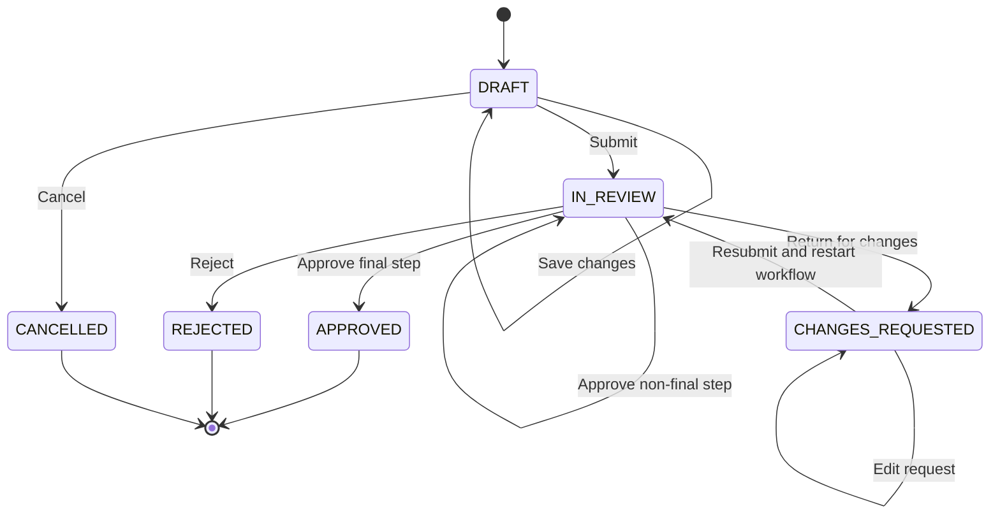
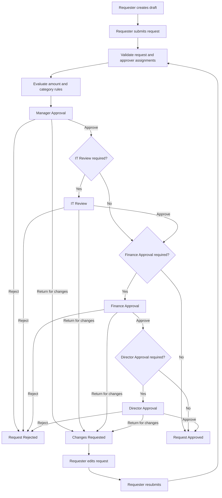

# FlowYield Purchase Request Workflow Specification

## 1. Purpose

This document defines the complete lifecycle of a purchase request in the FlowYield MVP.

It describes:

- request statuses;
- workflow-step statuses;
- approval-path generation;
- allowed actions;
- state transitions;
- return-for-changes behavior;
- rejection behavior;
- resubmission behavior;
- workflow completion;
- invalid transitions;
- audit requirements;
- SLA behavior;
- edge cases.

The workflow must behave deterministically and must not allow users to bypass required approvals.

---

## 2. Workflow Scope

The MVP implements one workflow:

**Purchase Request Approval**

The workflow starts when a Requester creates a purchase request and ends when the request is:

- approved;
- rejected;
- or cancelled while still in draft.

The workflow is sequential.

Only one approval step may be active at a time.

Parallel approvals are outside the MVP.

---

## 3. Purchase Request Fields

A purchase request contains at least:

- requester;
- department;
- title;
- description;
- business justification;
- category;
- supplier;
- requested amount;
- currency;
- expected purchase date;
- current status;
- current active step;
- submitted timestamp;
- completed timestamp;
- created timestamp;
- updated timestamp.

Optional future fields may include:

- cost center;
- project code;
- procurement reference;
- supporting attachments;
- preferred supplier;
- risk classification.

---

## 4. Purchase Categories

The MVP uses predefined categories such as:

- OFFICE_EQUIPMENT;
- SOFTWARE;
- IT_SERVICES;
- CLOUD_SERVICES;
- TRAINING;
- CONSULTING;
- MARKETING;
- LEGAL_SERVICES;
- FACILITIES;
- OTHER.

The following categories may trigger IT Review:

- SOFTWARE;
- IT_SERVICES.

Cloud Services may be added to the IT Review rule later if required.

---

## 5. Request Statuses

The purchase request uses the following statuses.

### DRAFT

The request has been created but not submitted.

Allowed actions:

- edit;
- save;
- cancel;
- submit.

### SUBMITTED

The request has been submitted and the system is preparing the workflow instance.

This may be a short-lived internal status.

Allowed actions:

- workflow initialization only.

Requester editing is not allowed.

### IN_REVIEW

The workflow is active and at least one approval step is pending or active.

Allowed actions depend on the current workflow step.

### CHANGES_REQUESTED

An approver returned the request to the Requester for correction.

Allowed actions:

- requester edits the request;
- requester adds a response;
- requester resubmits.

Approvers cannot continue until resubmission.

### APPROVED

All required workflow steps were approved.

This is a final status.

No additional approval action is allowed.

### REJECTED

An approver rejected the request.

This is a final status for the MVP.

The Requester may create a new request, but cannot reopen the rejected request.

### CANCELLED

The Requester cancelled a draft request.

This is a final status.

Only draft requests may be cancelled in the MVP.

---

## 6. Workflow Step Types

The MVP supports the following step types:

- MANAGER_APPROVAL;
- IT_REVIEW;
- FINANCE_APPROVAL;
- DIRECTOR_APPROVAL.

Each workflow step must contain:

- step type;
- sequence number;
- assigned user;
- required role;
- current status;
- activation timestamp;
- deadline;
- completion timestamp;
- decision;
- decision comment;
- decision actor;
- reason for inclusion;
- SLA status.

---

## 7. Workflow Step Statuses

### PENDING

The step exists but is not yet available for action.

A previous required step has not yet completed.

### ACTIVE

The step is the current actionable step.

Only an assigned and authorized user may make a decision.

### APPROVED

The assigned approver approved the step.

This is a completed step state.

### REJECTED

The assigned approver rejected the request at this step.

The request becomes `REJECTED`.

### CHANGES_REQUESTED

The assigned approver returned the request for correction.

The request becomes `CHANGES_REQUESTED`.

### SKIPPED

The step was not required by the applicable workflow rules.

For the MVP, unnecessary steps may be omitted entirely rather than stored as `SKIPPED`.

If `SKIPPED` is stored, the reason must be recorded.

### CANCELLED

The step was cancelled because the request workflow ended before the step became actionable.

For example, later pending steps may become `CANCELLED` after rejection.

---

## 8. Default Approval Rules

The default configurable thresholds are:

```text
Low-value threshold: EUR 1,000
High-value threshold: EUR 10,000
IT Review threshold: EUR 5,000
```

### Rule A — Low-Value Request

Condition:

```text
amount < 1,000 EUR
```

Required path:

```text
Manager Approval
```

### Rule B — Medium-Value Request

Condition:

```text
1,000 EUR <= amount <= 10,000 EUR
```

Required path:

```text
Manager Approval
Finance Approval
```

### Rule C — High-Value Request

Condition:

```text
amount > 10,000 EUR
```

Required path:

```text
Manager Approval
Finance Approval
Director Approval
```

### Rule D — IT Review

Condition:

```text
category in {SOFTWARE, IT_SERVICES}
and
amount > 5,000 EUR
```

IT Review is inserted after Manager Approval and before Finance Approval.

### Combined Medium-Value IT Path

Example:

```text
Category: SOFTWARE
Amount: EUR 7,200
```

Required path:

```text
Manager Approval
IT Review
Finance Approval
```

### Combined High-Value IT Path

Example:

```text
Category: IT_SERVICES
Amount: EUR 18,000
```

Required path:

```text
Manager Approval
IT Review
Finance Approval
Director Approval
```

---

## 9. Boundary Rules

Threshold boundaries must be deterministic.

The MVP uses the following interpretation:

```text
amount < 1,000
Manager Approval only
```

```text
1,000 <= amount <= 10,000
Manager Approval + Finance Approval
```

```text
amount > 10,000
Manager Approval + Finance Approval + Director Approval
```

For IT Review:

```text
amount > 5,000
```

A request of exactly EUR 5,000 does not require IT Review.

A request of exactly EUR 1,000 requires Finance Approval.

A request of exactly EUR 10,000 does not require Director Approval.

These boundaries must be covered by automated tests.

---

## 10. Currency Handling

The MVP should use EUR for all demonstration requests.

The currency field may still be stored for future extensibility.

Multi-currency conversion is outside the MVP.

Approval rules must not compare amounts across currencies without a defined exchange-rate mechanism.

Until such a mechanism exists, only EUR requests are accepted for workflow calculation.

---

## 11. Workflow Initialization

When a Requester submits a valid draft:

1. the system verifies authentication;
2. the system verifies that the Requester owns the request;
3. the system verifies that the request status is `DRAFT` or `CHANGES_REQUESTED`;
4. the system validates all required fields;
5. the system loads the active workflow configuration;
6. the system evaluates business rules;
7. the system calculates the required approval path;
8. the system stores the rule explanation;
9. the system creates the workflow steps;
10. the system assigns the required approvers;
11. the first step becomes `ACTIVE`;
12. later steps become `PENDING`;
13. the request becomes `IN_REVIEW`;
14. the first step deadline is calculated;
15. audit events are recorded.

The workflow path must be generated inside a controlled service layer, not directly in the route.

---

## 12. Approver Assignment

### Manager Approval

The Manager Approval step is assigned to the requester's configured manager.

The request cannot be submitted if:

* the Requester has no manager;
* the manager is inactive;
* the manager is the Requester;
* the manager lacks the required role.

The system should display a clear validation error.

### IT Review

The step is assigned to an active user with the `IT_REVIEWER` role.

For the MVP, a configured default IT Reviewer may be used.

### Finance Approval

The step is assigned to an active user with the `FINANCE_APPROVER` role.

For the MVP, a configured default Finance Approver may be used.

### Director Approval

The step is assigned to an active user with the `DIRECTOR_APPROVER` role.

For the MVP, a configured default Director Approver may be used.

### Assignment Failure

If no eligible approver exists:

* the workflow must not silently continue;
* the submission should fail before workflow activation;
* the request should remain editable;
* the error should identify the missing assignment category;
* the failed initialization attempt should be logged where appropriate.

---

## 13. Normal Approval Flow

For every active step:

1. the assigned approver opens the request;
2. the system verifies authorization;
3. the approver selects `Approve`;
4. the approver may provide a decision comment;
5. the system revalidates the step state;
6. the step becomes `APPROVED`;
7. the completion timestamp is stored;
8. the SLA result is calculated;
9. the next pending step becomes `ACTIVE`;
10. the next deadline is calculated;
11. the request remains `IN_REVIEW`;
12. audit events are recorded.

If no pending step remains:

* the request becomes `APPROVED`;
* the workflow completion timestamp is stored;
* the request completion timestamp is stored;
* the final SLA and process duration metrics become available.

---

## 14. Rejection Flow

An assigned approver may reject an active step.

A rejection comment is required.

When rejection occurs:

1. the active step becomes `REJECTED`;
2. the decision actor is stored;
3. the decision timestamp is stored;
4. the rejection reason is stored;
5. the request becomes `REJECTED`;
6. all future pending steps become `CANCELLED`;
7. the workflow completion timestamp is stored;
8. no further approval action is allowed;
9. audit events are recorded.

A rejected request cannot be resubmitted in the MVP.

The Requester may create a new request using the previous request as a reference, but cloning is outside the MVP.

---

## 15. Return-for-Changes Flow

An assigned approver may return an active request for correction.

A return comment is required.

When this action occurs:

1. the active step becomes `CHANGES_REQUESTED`;
2. the request becomes `CHANGES_REQUESTED`;
3. the decision actor is stored;
4. the decision comment is stored;
5. the return timestamp is stored;
6. future pending steps remain pending;
7. the Requester is allowed to edit permitted fields;
8. approval actions are blocked until resubmission;
9. audit events are recorded.

---

## 16. Editable Fields After Return

For the MVP, the Requester may edit:

* title;
* description;
* business justification;
* category;
* supplier;
* requested amount;
* expected purchase date;
* permitted attachments;
* response comment.

The Requester may not edit:

* requester identity;
* department ownership;
* historical approvals;
* workflow audit records;
* previous decision comments;
* timestamps;
* assigned approvers directly.

---

## 17. Resubmission Rules

When a Requester resubmits a returned request:

1. the system validates ownership;
2. the system verifies status `CHANGES_REQUESTED`;
3. the system validates the updated fields;
4. the system reevaluates the approval rules;
5. the system compares the new required path with the previous path;
6. the workflow is rebuilt or reconciled according to the policy below;
7. the relevant first review step becomes active;
8. the request returns to `IN_REVIEW`;
9. new deadlines are calculated;
10. audit events are recorded.

---

## 18. Resubmission Policy

For portfolio clarity and correctness, the MVP will use the following rule:

> A returned request restarts the approval workflow from the first approval step.

This means previous approvals do not remain valid after the Requester changes the request.

Reason:

* the amount may have changed;
* the category may have changed;
* the justification may have changed;
* the approval path may now be different;
* prior approvers approved a previous version of the request.

On resubmission:

* previous steps remain in history;
* the old workflow instance is marked as superseded or previous-cycle;
* a new approval cycle is created;
* the new path is recalculated;
* Manager Approval starts again.

This is safer and easier to explain than selectively preserving previous approvals.

---

## 19. Request Revision Tracking

Every resubmission should increase a revision number.

Example:

```text
Revision 1 — initial submission
Revision 2 — resubmission after Manager changes request
Revision 3 — resubmission after Finance changes request
```

Each revision should preserve:

* submitted values;
* submission timestamp;
* applicable workflow configuration;
* generated approval path;
* decisions;
* comments;
* SLA results.

For the MVP, revision history may be implemented through:

* a request revision entity;
* structured snapshots;
* or a workflow cycle model.

The final database design will decide the exact implementation.

---

## 20. Self-Approval Rule

A user may not approve a request they created.

This remains true even when the user holds the required approval role.

If the default approver is also the Requester:

* the system must find another eligible approver;
* or block workflow initialization.

The system must not silently bypass the step.

---

## 21. Duplicate Action Prevention

Before processing any decision, the system must verify:

* the request is still `IN_REVIEW`;
* the step is still `ACTIVE`;
* the user is still assigned;
* the step has no completed decision;
* the submitted action is valid;
* no previous identical action was processed.

Repeated submissions must not create duplicate decisions or advance multiple steps.

---

## 22. Invalid Transitions

The following transitions are invalid:

```text
DRAFT -> APPROVED
DRAFT -> REJECTED
APPROVED -> IN_REVIEW
REJECTED -> IN_REVIEW
CANCELLED -> SUBMITTED
IN_REVIEW -> DRAFT
CHANGES_REQUESTED -> APPROVED
```

The following step transitions are invalid:

```text
PENDING -> APPROVED
PENDING -> REJECTED
APPROVED -> ACTIVE
REJECTED -> ACTIVE
CANCELLED -> ACTIVE
```

Invalid transitions must raise a controlled business exception.

They must not be silently ignored.

---

## 23. Request State Transition Table

| Current Status    | Action                 | Required Actor    | Next Status       |
| ----------------- | ---------------------- | ----------------- | ----------------- |
| DRAFT             | Save                   | Request owner     | DRAFT             |
| DRAFT             | Submit                 | Request owner     | IN_REVIEW         |
| DRAFT             | Cancel                 | Request owner     | CANCELLED         |
| IN_REVIEW         | Approve non-final step | Assigned approver | IN_REVIEW         |
| IN_REVIEW         | Approve final step     | Assigned approver | APPROVED          |
| IN_REVIEW         | Reject                 | Assigned approver | REJECTED          |
| IN_REVIEW         | Return for changes     | Assigned approver | CHANGES_REQUESTED |
| CHANGES_REQUESTED | Edit                   | Request owner     | CHANGES_REQUESTED |
| CHANGES_REQUESTED | Resubmit               | Request owner     | IN_REVIEW         |

No transition is allowed from:

* APPROVED;
* REJECTED;
* CANCELLED.

---

## 24. Step State Transition Table

| Current Status | Action                 | Next Status       |
| -------------- | ---------------------- | ----------------- |
| PENDING        | Previous step approved | ACTIVE            |
| ACTIVE         | Approve                | APPROVED          |
| ACTIVE         | Reject                 | REJECTED          |
| ACTIVE         | Return for changes     | CHANGES_REQUESTED |
| PENDING        | Request rejected       | CANCELLED         |
| ACTIVE         | Request terminated     | CANCELLED         |

---

## 25. Mermaid State Diagram



---

## 26. Mermaid Workflow Diagram



---

## 27. SLA Behavior

An SLA deadline is calculated when a step becomes `ACTIVE`.

The SLA clock does not start while the step is `PENDING`.

When a step becomes active, the system stores:

* activation timestamp;
* SLA duration;
* deadline timestamp.

When a step is completed, the system stores:

* completion timestamp;
* completed-on-time status;
* overdue duration where applicable.

When a request is returned for changes:

* the active approval step stops;
* the requester correction period is tracked separately or excluded from approval-step SLA;
* the new approval cycle receives new SLA deadlines.

Business-hours and holiday calculations are outside the MVP.

The MVP uses elapsed clock hours.

---

## 28. Approaching-Deadline Rule

For the MVP, a step is `APPROACHING_DEADLINE` when at least 75% of its SLA duration has elapsed and the deadline has not yet passed.

Example:

```text
SLA duration: 48 hours
Approaching deadline begins after: 36 hours
```

SLA states:

* ON_TIME;
* APPROACHING_DEADLINE;
* OVERDUE;
* COMPLETED_ON_TIME;
* COMPLETED_LATE.

---

## 29. Audit Events

The workflow must produce structured audit events for:

* draft creation;
* draft update;
* request submission;
* workflow initialization;
* business-rule evaluation;
* approval-path generation;
* step assignment;
* step activation;
* approval;
* rejection;
* return for changes;
* request edit after return;
* resubmission;
* request approval;
* request rejection;
* request cancellation;
* invalid transition attempt;
* unauthorized decision attempt;
* duplicate decision attempt.

Audit metadata may include:

* request ID;
* revision number;
* workflow cycle;
* previous status;
* new status;
* step type;
* assigned user;
* rule explanation;
* decision comment;
* timestamp.

---

## 30. Business Exceptions

The workflow service should use controlled domain exceptions such as:

```text
InvalidTransitionError
UnauthorizedWorkflowActionError
ApproverAssignmentError
SelfApprovalError
DuplicateDecisionError
InactiveApproverError
MissingManagerError
WorkflowConfigurationError
RequestValidationError
```

Routes should translate these exceptions into:

* user-friendly browser messages;
* appropriate HTTP status codes;
* structured API errors;
* safe logs.

---

## 31. Transaction Requirements

Workflow transitions must run inside a database transaction.

A transition must update all related data atomically.

For example, approving a step may require:

* updating the current step;
* activating the next step;
* updating the request status;
* creating the decision record;
* creating audit records;
* calculating deadlines.

If one operation fails, the transaction must roll back.

The system must not leave the workflow in a partially updated state.

---

## 32. Required Automated Tests

The workflow test suite must include:

### Path Generation

* request below EUR 1,000;
* request at exactly EUR 1,000;
* request at exactly EUR 5,000;
* software request above EUR 5,000;
* request at exactly EUR 10,000;
* request above EUR 10,000;
* high-value IT request.

### Approval Flow

* one-step approval;
* two-step approval;
* three-step approval;
* IT Review path;
* high-value IT path;
* final request approval.

### Rejection

* rejection at Manager step;
* rejection at IT step;
* rejection at Finance step;
* rejection at Director step;
* future steps cancelled after rejection.

### Return for Changes

* return at each approval type;
* requester can edit returned request;
* unrelated user cannot edit;
* approval actions blocked while changes are requested;
* resubmission restarts the workflow;
* revision number increases;
* path recalculated after amount change;
* path recalculated after category change.

### Security

* unassigned approver cannot decide;
* wrong role cannot decide;
* requester cannot self-approve;
* inactive approver cannot decide;
* completed step cannot be decided again;
* later step cannot be approved early.

### SLA

* deadline created on activation;
* pending step has no active deadline;
* approaching-deadline calculation;
* overdue calculation;
* completed-on-time result;
* completed-late result.

### Transactions

* failed transition rolls back;
* duplicate submissions do not activate multiple steps;
* request and step states remain consistent.

---

## 33. Workflow Definition of Done

The Purchase Request Approval workflow is complete when:

* every valid amount and category combination generates the correct path;
* only one step is active at a time;
* assigned approvers can act;
* unauthorized users cannot act;
* self-approval is blocked;
* approvals activate the next step;
* final approval completes the request;
* rejection terminates the workflow;
* return for changes pauses approval processing;
* resubmission creates a new approval cycle;
* historical approvals remain visible;
* request revisions are traceable;
* SLA deadlines and results are calculated;
* every important transition creates an audit event;
* invalid transitions fail safely;
* workflow updates are transactional;
* critical behavior is covered by automated tests.
